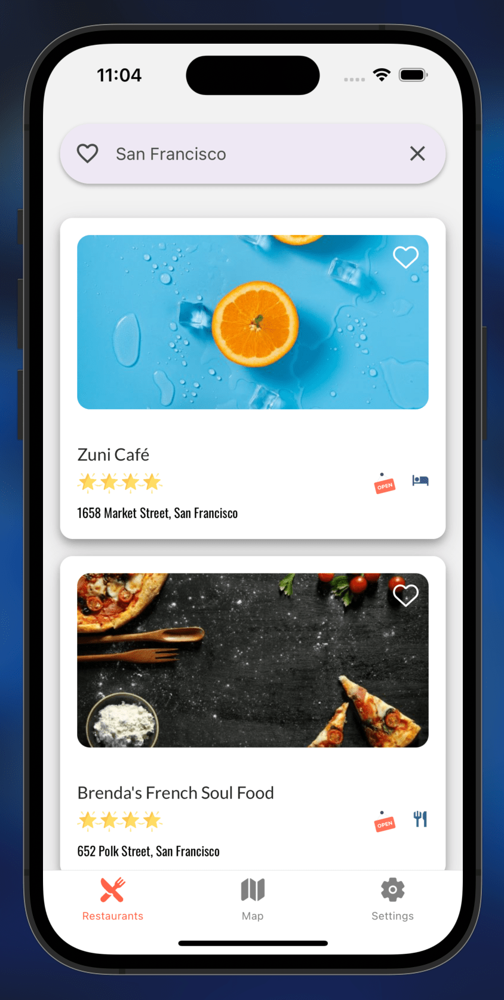
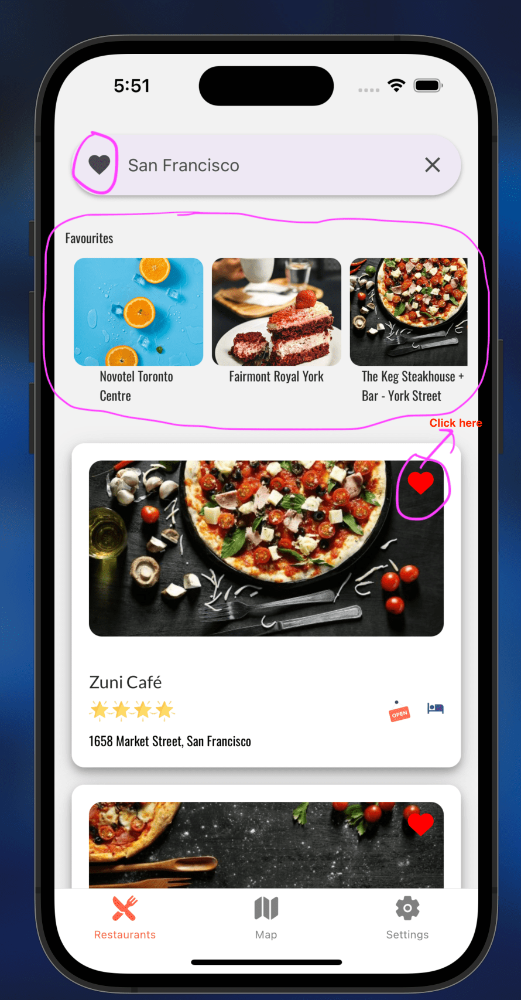
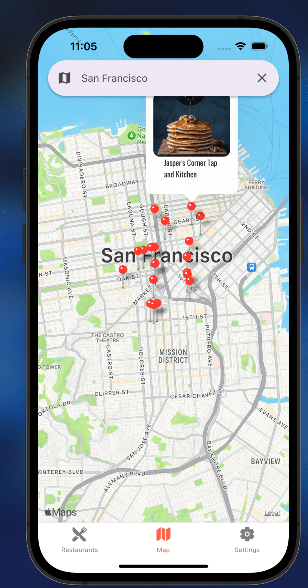
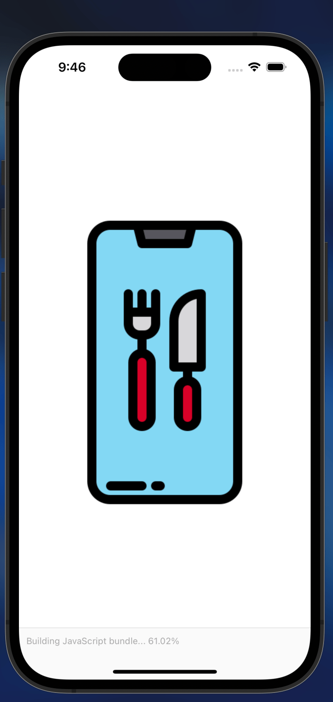

# MealsToGo - React Native Food Ordering App

## Home Tab

This tab serves as the main screen for users to explore and navigate through various food options available for ordering and restaurants

  - **Like Button**
    - Users can interact with a "LIKE" button for images.
    - View and manage liked items.
    - .

    - **Food Options Button**
    - Users can interact food options ONCE CLICKING on restaurant
    - View and manage types of food based on when time of day(Breakfast, Lunch Dinner, etc).
    - .

## Map Tab

The Map Tab allows users to view the geographical location of nearby restaurants and explore their offerings.

## Loading Screen

The Loading Screen provides users with a visual indication that the app is loading, enhancing the overall user experience.

**Credits to:** [Flaticon](https://www.flaticon.com/free-icons/food-app)

